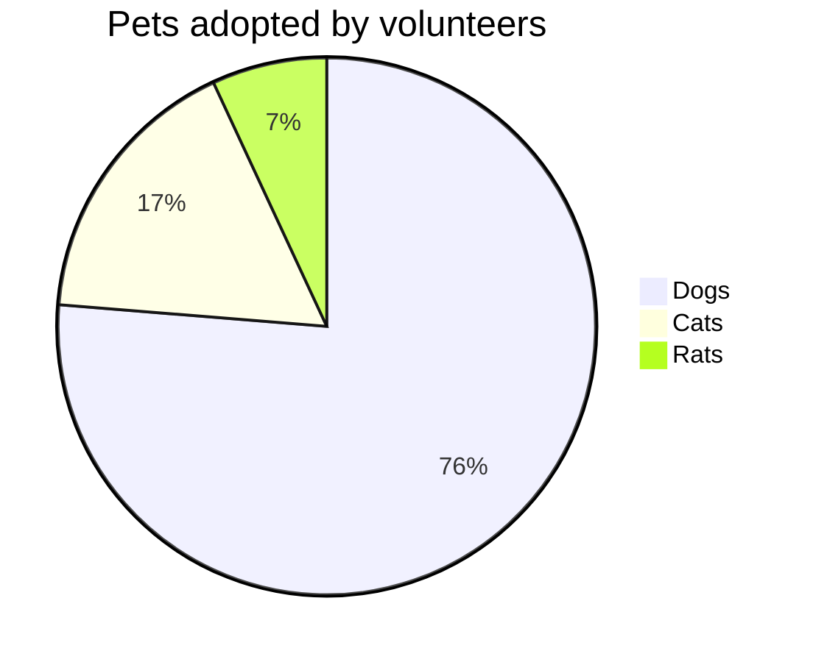
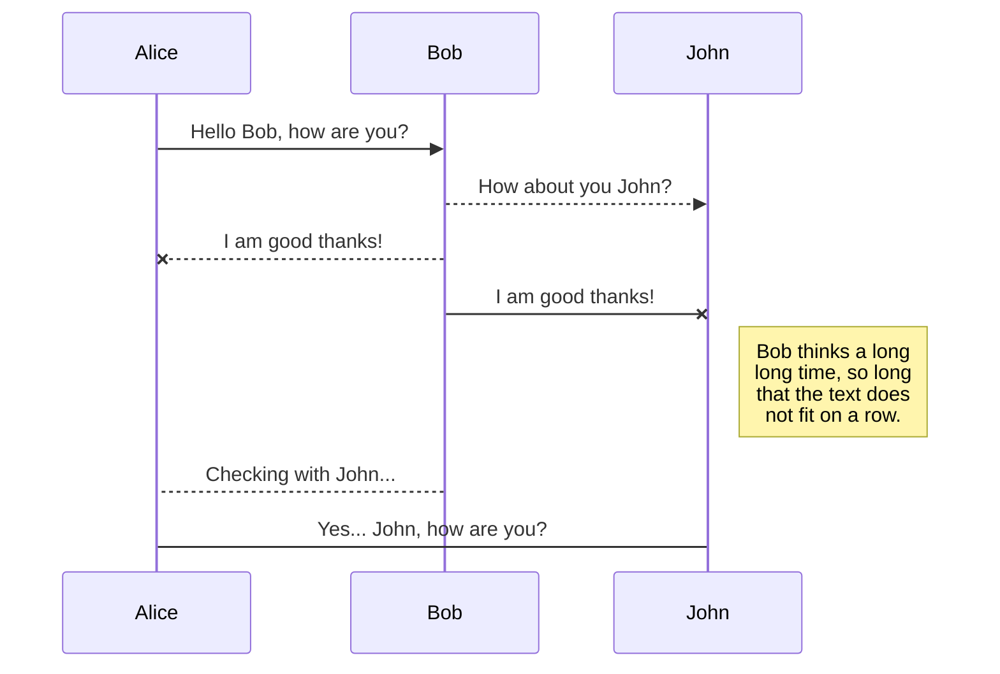
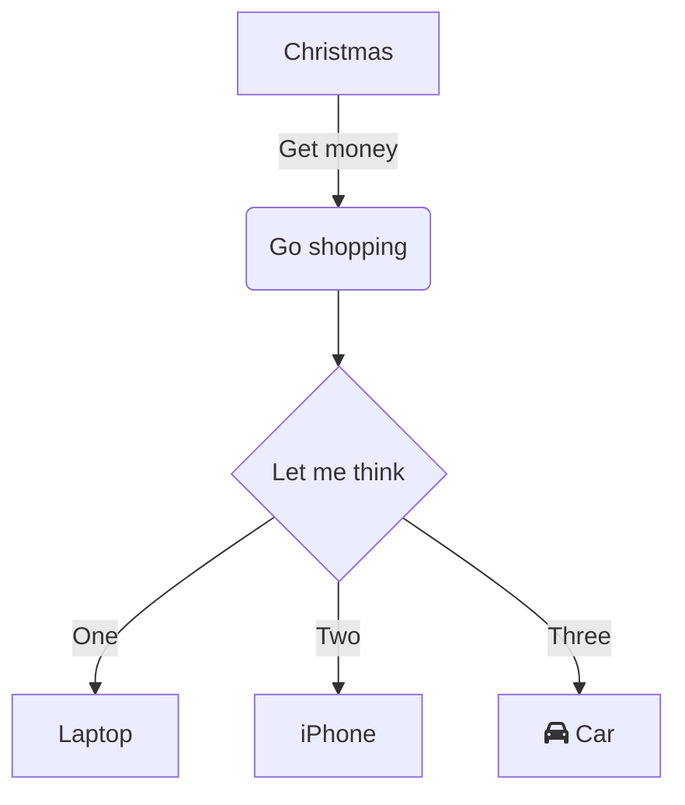
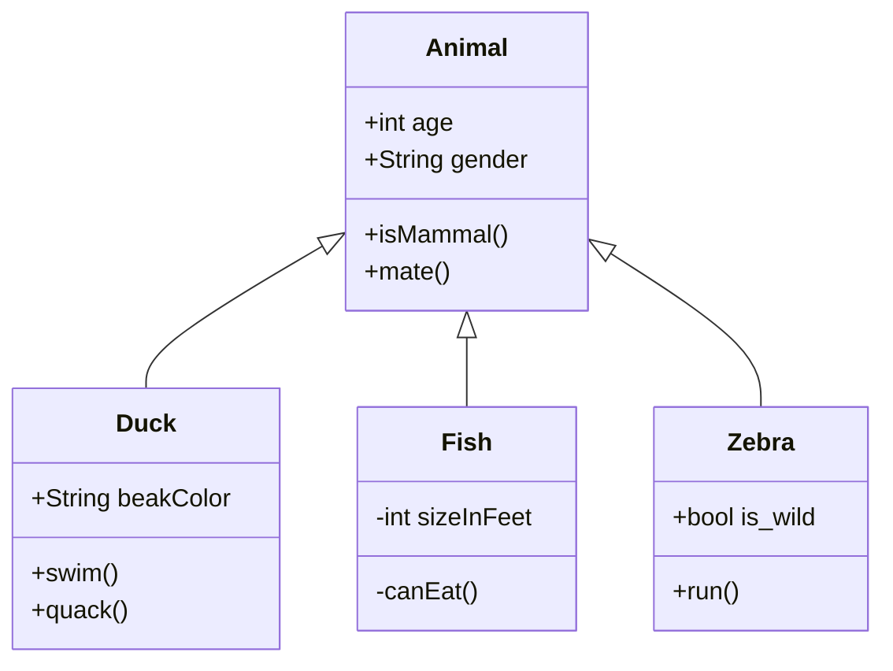
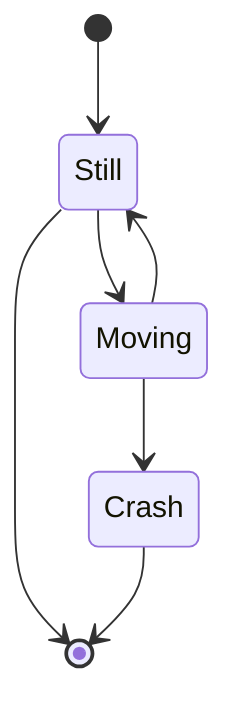

Headers
==

- 큰 제목
```markdown
작성할 제목
==
```

- 작은 제목
```markdown
작성할 소제목
--
```

---

글머리
--

```markdown
# H1
## H2
### H3
#### H4
##### H5
###### H6
```
# H1
## H2
### H3
#### H4
##### H5
###### H6

---
줄바꿈
--

- markdown 문서에서는 줄 바꿈시 `<br>` 또는 `   ` 공백 3칸으로 표현

```markdown
줄바꿈은`<br>`<br>또는`   `마지막칸의   
공백 3칸으로 변경한다.
```

줄바꿈은`<br>`<br>또는`   `마지막칸의   
공백 3칸으로 변경한다.

---
BlockQuote
--

`>` 를 이용하여 블럭을 나눠 사용 가능

> 첫번째 블럭
>> 두번째 블럭
>> > 세번째 블럭
>> > > 네번째 블럭

```markdown
> 첫번째 블럭
> > 두번째 블럭
> > > 세번째 블럭
> > > > 네번째 블럭
```

> BlockQuote 안에서는 코드블럭 및 다른 MD 요소의 사용이 가능하다
> - Line
> 	`1`
> 	**1**
> ```maekdown
> 코드블럭 등
> ```

Code Block
--
```codeblock
코드 블럭
```


---
수식
---

- MathJax 수식 사용
- `$$` 를 이용해서 원하는 수식을 표현이 가능
- `$$` 는 블록 수식 (가운데 정렬 됨)
- `$` 는 인라인 수식 (왼쪽 정렬 됨)

```latex
$$I = \int \rho R^{2} dV$$ 
```
$$I = \int \rho R^{2} dV$$
```latex
$I = \int \rho R^{2} dV$
```

$I = \int \rho R^{2} dV$

참고 : [위키백과 Tex 문법](https://ko.wikipedia.org/wiki/%EC%9C%84%ED%82%A4%EB%B0%B1%EA%B3%BC:TeX_%EB%AC%B8%EB%B2%95)

---

테이블 (표)
--

- `| | |` 를 사용하여 Table 구성
- ^^ 를 사용하여 Table 병합 가능
- |: 의 위치를 변경하여 텍스트 정렬이 가능

### Table 병합

```markdown
| Stage | Direct Products | ATP Yields |
| ----: | --------------: | ---------: |
|Glycolysis | 2 ATP                   ||
|^^         | 2 NADH      | 3--5 ATP   |
|Pyruvaye oxidation | 2 NADH | 5 ATP   |
|Citric acid cycle  | 2 ATP           ||
|^^                 | 6 NADH | 15 ATP  |
|^^                 | 2 FADH | 3 ATP   |
| 30--32 ATP                         |||
```

| Stage | Direct Products | ATP Yields |
| ----: | --------------: | ---------: |
|Glycolysis | 2 ATP                   ||
|^^         | 2 NADH      | 3--5 ATP   |
|Pyruvaye oxidation | 2 NADH | 5 ATP   |
|Citric acid cycle  | 2 ATP           ||
|^^                 | 6 NADH | 15 ATP  |
|^^                 | 2 FADH | 3 ATP   |
| 30--32 ATP                         |||

### 멀티라인 구성

```markdown
|:     Easy Multiline     :|||
|:------ |:------ |:-------- |
| Apple  | Banana |  Orange  \
| Apple  | Banana |  Orange  \
| Apple  | Banana |  Orange
| Apple  | Banana |  Orange  \
| Apple  | Banana |  Orange  |
| Apple  | Banana |  Orange  |
```

|:     Easy Multiline     :|||
|:------ |:------ |:-------- |
| Apple  | Banana |  Orange  \
| Apple  | Banana |  Orange  \
| Apple  | Banana |  Orange
| Apple  | Banana |  Orange  \
| Apple  | Banana |  Orange  |
| Apple  | Banana |  Orange  |

### 헤더가 없는 Table 구성

```markdown
|--|--|--|--|--|--|--|--|
|♜ |  |♝ |♛ |♚ |♝ |♞ |♜ |
|  |♟ |♟ |♟ |  |♟ |♟ |♟ |
|♟ |  |♞ |  |  |  |  |  |
|  |♗ |  |  |♟ |  |  |  |
|  |  |  |  |♙ |  |  |  |
|  |  |  |  |  |♘ |  |  |
|♙ |♙ |♙ |♙ |  |♙ |♙ |♙ |
|♖ |♘ |♗ |♕ |♔ |  |  |♖ |
```

|--|--|--|--|--|--|--|--|
|♜ |  |♝ |♛ |♚ |♝ |♞ |♜ |
|  |♟ |♟ |♟ |  |♟ |♟ |♟ |
|♟ |  |♞ |  |  |  |  |  |
|  |♗ |  |  |♟ |  |  |  |
|  |  |  |  |♙ |  |  |  |
|  |  |  |  |  |♘ |  |  |
|♙ |♙ |♙ |♙ |  |♙ |♙ |♙ |
|♖ |♘ |♗ |♕ |♔ |  |  |♖ |

### 텍스트 정렬

```markdown
| \:Fruits         ||  Food   :|
|:-------- |:------ |:-------- |
| Apple    | Banana |  Orange  |
| Apple    | Banana |  Orange  |


|          | Fruits\::        ||
|:-------- |:------ |:-------- |
| Apple    | Banana |  Orange  |
| Apple    | Banana |  Orange  |


|: \:Fruits       :||          |:       Food     :||
|:-------- |:------ |:-------- |:-------- |:------ |
| Apple    | Banana |  Orange  |:   Strawberry    :|
| Apple  &  Banana || ^^       |    Peach        :||


|: \:Fruits       :||          |:       Food     :||
| Apple    | Banana |  Orange  |:   Strawberry    :|


|:     Fruits \|\| Food           :|||
|:-------- |:-------- |:------------ |
| Apple    |: Apple  :|    Apple     \
| Banana   |  Banana  |    Banana    \
| Orange   |  Orange  |    Orange    |
|:   Rowspan is 5   :||:  How's it? :|
|^^   A. Peach       ||^^ 1. Fine    |
|^^   B. Orange      ||^^ 2. Bad  $I = \int \rho R^{2} dV$     |
|^^   C. Banana      ||   It's OK!  |
```

| \:Fruits         ||  Food   :|
|:-------- |:------ |:-------- |
| Apple    | Banana |  Orange  |
| Apple    | Banana |  Orange  |


|          | Fruits\::        ||
|:-------- |:------ |:-------- |
| Apple    | Banana |  Orange  |
| Apple    | Banana |  Orange  |


|: \:Fruits       :||          |:       Food     :||
|:-------- |:------ |:-------- |:-------- |:------ |
| Apple    | Banana |  Orange  |:   Strawberry    :|
| Apple  &  Banana || ^^       |    Peach        :||


|: \:Fruits       :||          |:       Food     :||
| Apple    | Banana |  Orange  |:   Strawberry    :|


|:     Fruits \|\| Food           :|||
|:-------- |:-------- |:------------ |
| Apple    |: Apple  :|    Apple     \
| Banana   |  Banana  |    Banana    \
| Orange   |  Orange  |    Orange    |
|:   Rowspan is 5   :||:  How's it? :|
|^^   A. Peach       ||^^ 1. Fine    |
|^^   B. Orange      ||^^ 2. Bad  $I = \int \rho R^{2} dV$     |
|^^   C. Banana      ||   It's OK!  |

---

다이어그램 그리기
--

### PlantUML을 이용한 다이어 그램 그리기

- 시작은 @startuml
- 끝은 @enduml

```plantuml!
### PlantUML Block-1

@startuml
Bob -> Alice : hello
@enduml


### PlantUML Block-2
@startuml
Bob -> Alice : hello world
@enduml

### PlantUML Block-3
@startuml
(*) --> "Initialization"

if "Some Test" then
  -->[true] "Some Activity"
  --> "Another activity"
  -right-> (*)
else
  ->[false] "Something else"
  -->[Ending process] (*)
endif
@enduml


### PlantUML Block-4

@startuml
skinparam handwritten true

skinparam usecase {
  BackgroundColor DarkSeaGreen
  BorderColor DarkSlateGray

  BackgroundColor<< Main >> YellowGreen
  BorderColor<< Main >> YellowGreen

  ArrowColor Olive
  ActorBorderColor black
  ActorFontName Courier

  ActorBackgroundColor<< Human >> Gold
}

User << Human >>
:Main Database: as MySql << Application >>
(Start) << One Shot >>
(Use the application) as (Use) << Main >>

User -> (Start)
User --> (Use)

MySql --> (Use)

@enduml
```



### PlantUML Block-1

@startuml
Bob -> Alice : hello
@enduml


### PlantUML Block-2

@startuml
Bob -> Alice : hello world
@enduml


### PlantUML Block-3
@startuml
(*) --> "Initialization"

if "Some Test" then
  -->[true] "Some Activity"
  --> "Another activity"
  -right-> (*)
else
  ->[false] "Something else"
  -->[Ending process] (*)
endif
@enduml


### PlantUML Block-4

@startuml
skinparam handwritten true

skinparam usecase {
  BackgroundColor DarkSeaGreen
  BorderColor DarkSlateGray

  BackgroundColor<< Main >> YellowGreen
  BorderColor<< Main >> YellowGreen

  ArrowColor Olive
  ActorBorderColor black
  ActorFontName Courier

  ActorBackgroundColor<< Human >> Gold
}

User << Human >>
:Main Database: as MySql << Application >>
(Start) << One Shot >>
(Use the application) as (Use) << Main >>

User -> (Start)
User --> (Use)

MySql --> (Use)

@enduml

---

Mermaid 를 이용한 차트 및 플로우 차트 만들기
--

- 코드 블럭을 이용하여 그릴 수 있다.

### 원형차트 





### 2. 시퀀스 다이어그램
  







### 3. class 다이어 그램




### 4. State 다이어그램




마치며
--

더 다양한 문법들은  해당 지원 공식 홈페이지 및 Wiki를 통해 알아볼 수 있다.