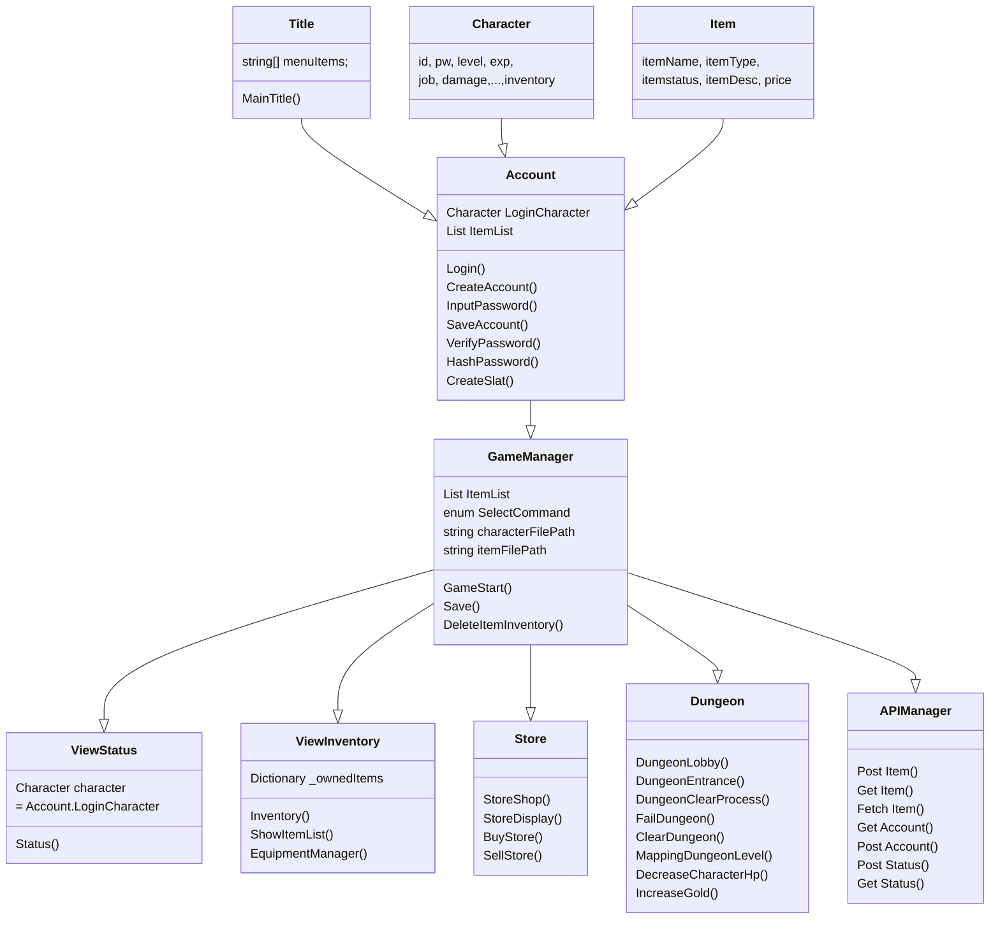

Project Dungeon RPG
--

## 기획

### 프로젝트 구성

|목록|내용|
|:--|:--|
|타이틀|Dungeon RPG|
|기간|23.11.09 ~ 23.11.13|
|개발인원|1명 이정훈|
|IDE|Rider|
|Env|Mac Slicon|
|Language|C#|
|Rendering|Rider Console|
|개요|1. 던전을 떠나기전 마을에서 장비를 구하는 게임을 텍스트로 구현<br>2. 상점의 아이템 중에서 나만의 장비를 구성하는 부분이 포인트<br>3. 장비는 여러개의 데이터가 함께 있는 객체 구조|

### 필수요구사항
#### 게임시작화면
1. 게임 시작화면 : 게임 시작시 간단한 소개말, 행동 선택지 제공
2. 원하는 행동의 숫자는 입력 타이핑으로 실행
	* 입력값 기준을 벗어나면 **잘못된 입력입니다.** 출력

	```csharp
	스파르타 마을에 오신 여러분 환영합니다.
	이곳에서 던전으로 들어가기 전 활동을 할 수 있습니다.
	
	1. 상태 보기
	2. 인벤토리
	
	원하시는 행동을 입력해주세요.
	>>
	```

#### 상태보기
1. 캐릭터의 정보를 표시합니다.
2. 7개의 속성을 가지고 있습니다. 레벨 / 이름 / 직업 / 공격력 / 방어력 / 체력 / Gold
3. 처음 기본값은 이름을 제외하고는 아래와 동일하게 만들어주세요
4. 이후 장착한 아이템에 따라 수치가 변경 될 수 있습니다.

```csharp
상태 보기
캐릭터의 정보가 표시됩니다.

Lv. 01      
Chad ( 전사 )
공격력 : 10
방어력 : 5
체 력 : 100
Gold : 1500 G

0. 나가기

원하시는 행동을 입력해주세요.
>>
```

#### 인벤토리
1. 보유 중인 아이템을 전부 보여줍니다. 이때 장착중인 아이템 앞에는 `[E]` 표시를 붙여 줍니다.
2. 처음 시작시에는 2가지 아이템이 있습니다.

```csharp
**인벤토리**
보유 중인 아이템을 관리할 수 있습니다.

[아이템 목록]
- [E]무쇠갑옷      | 방어력 +5 | 무쇠로 만들어져 튼튼한 갑옷입니다.
- 낡은 검         | 공격력 +2 | 쉽게 볼 수 있는 낡은 검 입니다.

1. 장착 관리
0. 나가기

원하시는 행동을 입력해주세요.
>>
```

##### 장착 관리
- 장착관리가 시작되면 아이템 목록 앞에 숫자가 표시됩니다.
- 일치하는 아이템을 선택했다면 (예제에서 1~2선택시)
	    * 장착중이지 않다면 → 장착 [E] 표시 추가
	    * 이미 장착중이라면 → 장착 해제 [E] 표시 없애기
- 일치하는 아이템을 선택했지 않았다면 (예제에서 1~3이외 선택시)
	    * **잘못된 입력입니다** 출력
- 아이템의 중복 장착을 허용합니다.
	    * 창과 검을 동시에 장착가능
	    * 갑옷도 동시에 착용가능
	    * 장착 갯수 제한 X

```csharp
**인벤토리 - 장착 관리**
보유 중인 아이템을 관리할 수 있습니다.

[아이템 목록]
- 1 [E]무쇠갑옷      | 방어력 +5 | 무쇠로 만들어져 튼튼한 갑옷입니다.
- 2 낡은 검         | 공격력 +2 | 쉽게 볼 수 있는 낡은 검입니다.

0. 나가기

원하시는 행동을 입력해주세요.
>>
```

- 아이템이 장착되었다면 상태보기에 정보가 반영되어야 합니다.
    * 정보 반영 예제
        
        ```csharp
        **상태 보기**
        캐릭터의 정보가 표시됩니다.
        
        Lv. 01      
        Chad ( 전사 )
        공격력 : 12 (+2)
        방어력 : 10 (+5)
        체 력 : 100
        Gold : 1500 G
        
        0. 나가기
        
        원하시는 행동을 입력해주세요.
        >>
        ```


### 선택요구사항

1. 아이템 정보를 클래스 / 구조체로 활용해 보기
2. 아이템 정보를 배열로 관리하기
3. 아이템 추가하기 - 인벤토리에 나만의 새로운 아이템을 추가해보기 (난이도 - ☆☆☆☆☆)
4. 콘솔 꾸미기 - 콘솔의 색 지정, 라인 정렬등을 이용해 꾸며보기 (난이도 - ★☆☆☆☆)
5. 인벤토리 크기 맞춤 (난이도 - ★☆☆☆☆)
- 인벤토리 내용을 보면 이름의 글자 갯수, 설명의 글자 갯수가 각각 다릅니다.
	- 이름에 따라 크기가 결정되지 않고 인벤토리 레이아웃을 고정해보세요.   
    
    ```csharp
    **인벤토리**
    보유 중인 아이템을 관리할 수 있습니다.
    
    [아이템 목록]
          아이템 이름       효과              설명
    - ----10----|----10----|---------------30--------------
    - ----10----|----10----|---------------30--------------
    
    1. 장착 관리
    0. 나가기
    
    원하시는 행동을 입력해주세요.
    >>
    ```
    
    ```csharp
    **인벤토리**
    보유 중인 아이템을 관리할 수 있습니다.
    
    [아이템 목록]
    - [E]무쇠갑옷      | 방어력 +5  | 무쇠로 만들어져 튼튼한 갑옷입니다.
    - 낡은 검         | 공격력 +2  | 쉽게 볼 수 있는 낡은 검입니다.
    
    1. 장착 관리
    0. 나가기
    
    원하시는 행동을 입력해주세요.
    >>
    ```
    
6. 인벤토리 정렬하기 (난이도 - ★★★☆☆)
    - 인벤토리에 있는 아이템을 이름이 긴 순서대로 정렬합니다.   
    
    ```csharp
    **인벤토리**
    보유 중인 아이템을 관리할 수 있습니다.
    
    [아이템 목록]
    - 1 [E]무쇠갑옷      | 방어력 +5 | 무쇠로 만들어져 튼튼한 갑옷입니다.
    - 2 낡은 검         | 공격력 +2 | 쉽게 볼 수 있는 낡은 검입니다.
    
    1. 아이템 정렬
    0. 나가기
    
    원하시는 행동을 입력해주세요.
    >>
    ```
    
    - 추가 기능을 원한다면 정렬 옵션을 다양하게 적용 할 수 있습니다.
        
        ```csharp
        **인벤토리 - 아이템 정렬**
        보유 중인 아이템을 관리할 수 있습니다.
        
        [아이템 목록]
        - 1 [E]무쇠갑옷      | 방어력 +5 | 무쇠로 만들어져 튼튼한 갑옷입니다.
        - 2 낡은 검         | 공격력 +2 | 쉽게 볼 수 있는 낡은 검입니다.
        
        1. 이름
        2. 장착순
        3. 공격력
        4. 방어력 
        0. 나가기
        
        원하시는 행동을 입력해주세요.
        >>
        ```
        
7. 상점 - 아이템 구매 (난이도 - ★★★★☆)
    - 게임 시작 화면에 3. 상점을 추가합니다.
    - 보유중인 골드와 아이템의 정보,가격이 표시됩니다.
    - 아이템 정보 오른쪽에는 가격이 표시가 됩니다.
    - 이미 구매를 완료한 아이템이라면 **구매완료** 로 표시됩니다.   
    
    ```csharp
    스파르타 마을에 오신 여러분 환영합니다.
    이곳에서 던전으로 들어가기 전 활동을 할 수 있습니다.
    
    1. 상태 보기
    2. 인벤토리
    3. 상점
    
    원하시는 행동을 입력해주세요.
    >>
    ```
    
    ```csharp
    **상점**
    필요한 아이템을 얻을 수 있는 상점입니다.
    
    [보유 골드]
    800 G
    
    [아이템 목록]
    - 수련자 갑옷    | 방어력 +5  | 수련에 도움을 주는 갑옷입니다.             |  1000 G
    - 무쇠갑옷      | 방어력 +9  | 무쇠로 만들어져 튼튼한 갑옷입니다.           |  구매완료
    - 스파르타의 갑옷 | 방어력 +15 | 스파르타의 전사들이 사용했다는 전설의 갑옷입니다.|  3500 G
    - 낡은 검      | 공격력 +2  | 쉽게 볼 수 있는 낡은 검 입니다.            |  600 G
    - 청동 도끼     | 공격력 +5  |  어디선가 사용됐던거 같은 도끼입니다.        |  1500 G
    - 스파르타의 창  | 공격력 +7  | 스파르타의 전사들이 사용했다는 전설의 창입니다. |  구매완료
    
    1. 아이템 구매
    0. 나가기
    
    원하시는 행동을 입력해주세요.
    >>
    ```
    
    7 - 1. 아이템 구매
    - **아이템 구매** 를 선택하면 아이템 목록 앞에 숫자가 표시됩니다.
    - 일치하는 아이템을 선택했다면 (예제에서 0~6선택시)
        - 이미 구매한 아이템이라면 → **이미 구매한 아이템입니다** 출력
        - 구매가 가능하다면
            - 보유 금액이 충분하다면 → **구매를 완료했습니다.** 출력 재화 감소 / 인벤토리에 아이템 추가 / 상점에 구매완료 표시
            - 보유 금액이 부족하다면 → **Gold 가 부족합니다.** 출력
    - 일치하는 아이템을 선택했지 않았다면 (예제에서 1~3이외 선택시)
        - **잘못된 입력입니다** 출력   
    
    ```csharp
    **상점 - 아이템 구매**
    필요한 아이템을 얻을 수 있는 상점입니다.
    
    [보유 골드]
    800 G
    
    [아이템 목록]
    - 1 수련자 갑옷    | 방어력 +5  | 수련에 도움을 주는 갑옷입니다.             |  1000 G
    - 2 무쇠갑옷      | 방어력 +9  | 무쇠로 만들어져 튼튼한 갑옷입니다.           |  구매완료
    - 3 스파르타의 갑옷 | 방어력 +15 | 스파르타의 전사들이 사용했다는 전설의 갑옷입니다.|  3500 G
    - 4 낡은 검      | 공격력 +2  | 쉽게 볼 수 있는 낡은 검 입니다.            |  600 G
    - 5 청동 도끼     | 공격력 +5  |  어디선가 사용됐던거 같은 도끼입니다.        |  1500 G
    - 6 스파르타의 창  | 공격력 +7  | 스파르타의 전사들이 사용했다는 전설의 창입니다. |  구매완료
    
    0. 나가기
    
    원하시는 행동을 입력해주세요.
    >>
    ```
    
- 7 - 2. 상점 - 아이템 판매 (난이도 - ★★★☆☆) - 선행과제 [7. 상점 - 아이템 구매]
    - 상점에 아이템 판매 기능을 추가합니다.
    - 판매 시 구매가격의 **85% 가격**에 판매합니다.
    - 판매시 **장착하고 있는 아이템이었다면 해제** 됩니다.   
    
    ```csharp
    **상점**
    필요한 아이템을 얻을 수 있는 상점입니다.
    
    [보유 골드]
    800 G
    
    [아이템 목록]
    - 수련자 갑옷    | 방어력 +5  | 수련에 도움을 주는 갑옷입니다.             |  1000 G
    - 무쇠갑옷      | 방어력 +9  | 무쇠로 만들어져 튼튼한 갑옷입니다.           |  구매완료
    - 스파르타의 갑옷 | 방어력 +15 | 스파르타의 전사들이 사용했다는 전설의 갑옷입니다.|  3500 G
    - 낡은 검      | 공격력 +2  | 쉽게 볼 수 있는 낡은 검 입니다.            |  600 G
    - 청동 도끼     | 공격력 +5  |  어디선가 사용됐던거 같은 도끼입니다.        |  1500 G
    - 스파르타의 창  | 공격력 +7  | 스파르타의 전사들이 사용했다는 전설의 창입니다. |  구매완료
    
    1. 아이템 구매
    2. 아이템 판매
    0. 나가기
    
    원하시는 행동을 입력해주세요.
    >>
    ```
    
    ```csharp
    **상점 - 아이템 판매**
    필요한 아이템을 얻을 수 있는 상점입니다.
    
    [보유 골드]
    800 G
    
    [아이템 목록]
    - 무쇠갑옷      | 방어력 +9  | 무쇠로 만들어져 튼튼한 갑옷입니다.           |  1800 G
    - 스파르타의 창  | 공격력 +7  | 스파르타의 전사들이 사용했다는 전설의 창입니다. |  2700 G
    
    0. 나가기
    
    원하시는 행동을 입력해주세요.
    >>
    ```
    
8. 장착 개선 (난이도 - ★★☆☆☆)    
    - 각 타입별로 하나의 아이템만 장착가능 - ( 방어구 / 무기 )
    - 방어구를 장착하면 기존 방어구가 있다면 해제하고 장착
    - 무기를 장착하면 기존 무기가 있다면 해제하고 장착   
    
    ```csharp
    **인벤토리 - 장착 관리**
    보유 중인 아이템을 관리할 수 있습니다.
    
    [아이템 목록]
    - 1 [E]무쇠갑옷      | 방어력 +5 | 무쇠로 만들어져 튼튼한 갑옷입니다.
    - 2 [E]스파르타의 창  | 공격력 +7 | 스파르타의 전사들이 사용했다는 전설의 창입니다.
    - 3 낡은 검         | 공격력 +2 | 쉽게 볼 수 있는 낡은 검 입니다.
    
    0. 나가기
    
    원하시는 행동을 입력해주세요.
    >>
    ```
    
9. 던전입장 (난이도 - ★★★★☆)    
    - 던전은 3가지 난이도가 있습니다.
    - 방어력으로 던전을 수행할 수 있을지 판단합니다.
        - 권장 방어력보다 낮다면
            - 40% 확률로 던전 실패
                - 보상 없고 체력 감소 절반
        - 권장 방어력 보다 높다면
            - 던전 클리어
                - 권장 방어력 +- 에 따라 종료시 체력 소모 반영
                    - 기본 체력 감소량
                        - 20 ~ 35 랜덤
                        - (내 방어력 - 권장 방어력) 만큼 랜덤 값에 설정
                        - ex) 권장 방어력 5, 내 방어력 7 20(-2) ~ 35(-2) 랜덤
                        - ex) 권장 방어력 11, 내 방어력 5 20(+6) ~ 35(+6) 랜덤
    - 공격력으로 던전 클리어시 보상을 어느정도 얻을지 계산됩니다.
        - 각 던전별 기본 클리어 보상
            - 쉬운 던전 - 1000 G
            - 일반 던전 - 1700 G
            - 어려운 던전 - 2500 G
        - 공격력 ~ 공격력 * 2 의 % 만큼 추가 보상 획득 가능
            - ex) 공격력 10, 쉬움 던전 기본 보상 1000 G 공격력으로 인한 추가 보상 10 ~ 20%
            - ex) 공격력 15, 어려운 던전 기본 보상 2500 G 공격력으로 인한 추가 보상 15 ~ 30%   
    
    ```csharp
    스파르타 마을에 오신 여러분 환영합니다.
    이곳에서 던전으로 들어가기전 활동을 할 수 있습니다.
    
    1. 상태 보기
    2. 인벤토리
    3. 상점
    4. 던전입장
    
    원하시는 행동을 입력해주세요.
    >>
    ```
    
    ```csharp
    **던전입장**
    이곳에서 던전으로 들어가기전 활동을 할 수 있습니다.
    
    1. 쉬운 던전     | 방어력 5 이상 권장
    2. 일반 던전     | 방어력 11 이상 권장
    3. 어려운 던전    | 방어력 17 이상 권장
    0. 나가기
    
    원하시는 행동을 입력해주세요.
    >>
    ```
    
    ```csharp
    **던전 클리어**
    축하합니다!!
    쉬운 던전을 클리어 하였습니다.
    
    [탐험 결과]
    체력 100 -> 70
    Gold 1000 G -> 2200 G 
    
    0. 나가기
    
    원하시는 행동을 입력해주세요.
    >>
    ```
    
- 9 - 1. 휴식 기능 (난이도 - ★☆☆☆☆) - 선행 과제 [9. 던전입장]
    
    - 휴식을 선택하면 500G 으로 체력을 회복합니다.
        - 보유 금액이 충분하다면 → **휴식을 완료했습니다.** 출력
        - 보유 금액이 부족하다면 → **Gold 가 부족합니다.** 출력
    - 휴식시 체력은 100까지 회복됩니다.
    - 보유 골드 표시   
    
    ```csharp
    스파르타 마을에 오신 여러분 환영합니다.
    이곳에서 던전으로 들어가기전 활동을 할 수 있습니다.
    
    1. 상태 보기
    2. 인벤토리
    3. 상점
    4. 던전입장
    5. 휴식하기
    
    원하시는 행동을 입력해주세요.
    >>
    ```
    
    ```csharp
    **휴식하기**
    500 G 를 내면 체력을 회복할 수 있습니다. (보유 골드 : 800 G)
    
    1. 휴식하기
    0. 나가기
    
    원하시는 행동을 입력해주세요.
    >>
    ```
    
- 9 - 2. 레벨업 기능 (난이도 - ★★☆☆☆) - 선행 과제 [9. 던전입장]
    - 던전을 여러번 클리어할 수록 레벨이 증가합니다.
        - Lv1 → Lv2 - 1회 클리어
        - Lv2 → Lv3 - 2회 클리어
        - Lv3 → Lv4 - 3회 클리어
        - Lv4 → Lv5 - 4회 클리어
    - 레벨업시 기본 공격력이 0.5 방어력이 1 증가합니다.

10. 게임 저장하기 (난이도 - ★★★★★★)
    - 앱을 껏다 켜도 사용되던 정보를 유지합니다.

11. 나만의 기능을 만들어보기! → 자신이 원하는 기능을 자유롭게 추가해보세요.

나만의 기능
--

- 콘솔 게임이지만 간단하게 No-SQL을 이용한 서버통신 방식을 적용시킬 예정

> 1. 케릭터 생성
> 2. 로그인
> 3. 케릭터별 인벤토리 별도 구성
> 4. 서버연결
> 5. No SQL 서버 연결하여 오브젝트 별도 관리
> 6. 던전 사냥 ASCII ART 적용
> 7. 타이틀 ASCII ART 적용


Project Class Structure
--

- 대략적인 프로젝트 Class 구성은 다음과 같다.




